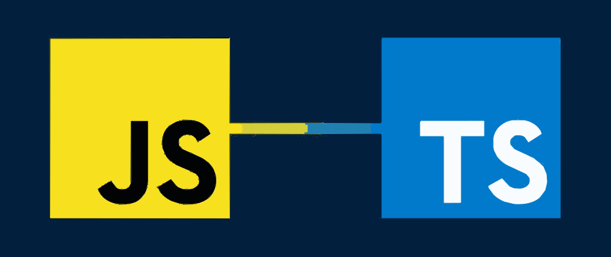

#   AI-Powered-JavaScript-to-Typescript-Guide
### *This is a ai powered guide to help me convert my javascript code to typescript and debug any issues in my code and correct it using Gemini Api and React,Nodejs and Express*

## 🎨 Preview

! Send the Request Here by Pasting or Writing the Code and Press Review! Request is Being Processed! Response! Response Header with Server:Nginx! Rate Limiting Based on IP to prevent single user from making multiple requests

## 

## Architecture 

## 🛠 Tech Stack

* **Frontend:** React
* **Backend:** Node.js (Express)
* **AI Engine:** Gemini API
* **Infrastructure:** Docker , Nginx and AWS(EC2 instance)

