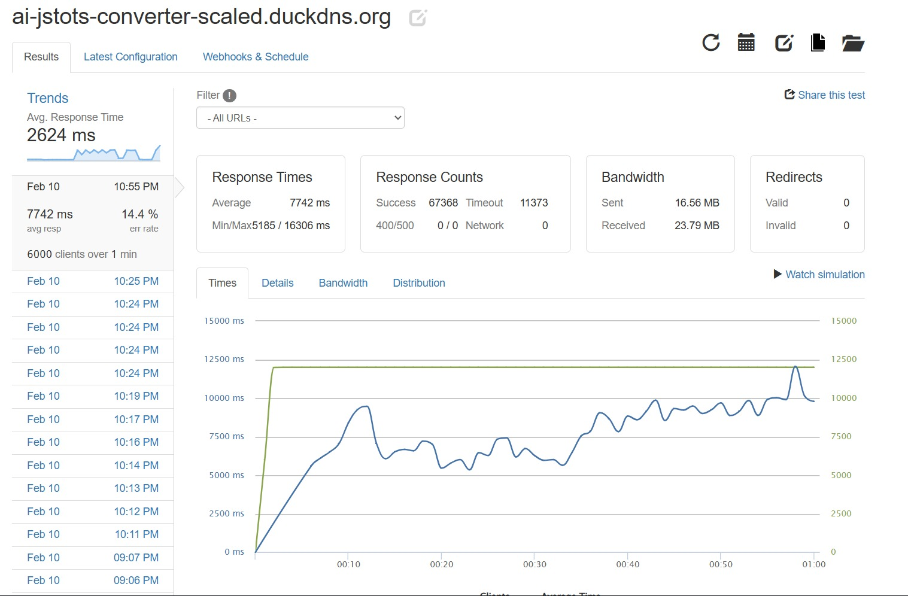
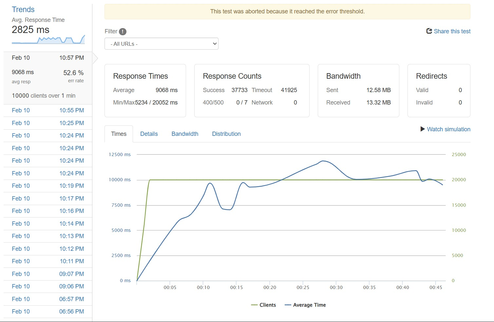

#   AI-Powered-JavaScript-to-Typescript-Guide
### *This is an ai powered guide to help me convert my javascript code to typescript and debug any issues in my code and correct it using Gemini Api and React,Nodejs and Express*

## 📌 Table of Contents
* [🎨 Preview](#-preview)
* [🏗 Architecture](#-architecture)
* [Capacity Planning and Estimation](#capacity-planning-and-estimation)

## 🎨 Preview

! Send the Request Here by Pasting or Writing the Code and Press Review! Request is Being Processed! Response! Response Header with Server:Nginx! Rate Limiting Based on IP to prevent single user from making multiple requests

## 

## 🏗 Architecture 

1. **Frontend (React on Vercel):** The user pastes their JavaScript code into a React-based UI hosted on Vercel. When the user clicks "Review," the React frontend sends a POST request (`/ai/get-review`) containing the code to the backend.
2. **Reverse Proxy (Nginx on AWS EC2):** The request hits the Nginx reverse proxy hosted on an AWS EC2 instance. Nginx handles SSL termination, connection limiting, IP-based rate limiting, and forwards the request to the Node.js backend using the least connection load balancing strategy.
3. **Backend Engine (Node.js/Express):** The Node.js Express server receives the request. The controller (`ai.controller.js`) validates the input and calls the AI service (`ai.services.js`).
4. **AI Generation (Gemini API):** The AI service communicates with the Google Gemini (`gemini-2.5-flash`) API. It passes a highly tuned system prompt that instructs the AI to aggressively analyze the JavaScript and generate strict, production-ready TypeScript code. 
5. **Response:** Once Gemini returns the TypeScript code (and handling any 429/503 retries optimally), the backend sends the response back through Nginx to the Vercel frontend.

## 🛠 Tech Stack

* **Frontend:** React
* **Backend:** Node.js (Express)
* **AI Engine:** Gemini API
* **Infrastructure:** Docker , Nginx , AWS(EC2 instance) and Vercel

## Capacity Planning and Estimation

Our infrastructure is highly optimized to handle substantial concurrent traffic smoothly, utilizing custom Nginx and system-level configurations on our AWS EC2 instance:

### 1. Maximum Connection Capacity (System & Nginx)
* **OS File Descriptor Limits:** The EC2 Linux environment (`limits.conf`, `commonsession.conf`, & Systemd `editnginx.conf`) has `nofile` (LimitNOFILE) strictly set to **65,536**. This is a hard OS boundary for maximum open sockets.
* **Nginx Workers & Connections:** Nginx is configured with `worker_processes 2` and `worker_connections 30000`. This gives the reverse proxy a theoretical maximum capacity of **60,000 simultaneous connections** (2 × 30,000), safely fitting within the OS file descriptor limits. **Important:** Because Nginx acts as a reverse proxy, each client request consumes *two* connections: one connection between the client (Frontend on Vercel) and Nginx, and another between Nginx and the Node.js backend container. Therefore, the actual maximum number of concurrent client requests the system can handle is **30,000**.
* **Throughput Estimation:** Based on my estimates introducing a 5-second response delay (to mimic the processing time of the Gemini API), the system system should achieve a throughput of **~6,000 requests per second (RPS)**. This aligns perfectly with the calculationo: **30,000 concurrent capacity ÷ 5 seconds average response time = 6,000 RPS**.

* **Throughput Observations & Bottlenecks:** While Nginx is configured to handle up to 30,000 concurrent client requests, actual throughput depends on hardware compute capacity. I ran a stress test injecting 6,000 clients per second for a minute using Loader.io, simulating a 5-second processing delay to mimic GEMINI API's response time.
    * **Actual Throughput:** The system sustained an average of ~1,122 processed requests per second (67,368 total successful requests). 
    * **Hardware & Context Switching Limits:** The EC2 instance running the test is limited to 2 CPU threads. When pushing 6,000 RPS, the system spends significant CPU cycles constantly context-switching between the OS layer, Nginx, Docker and the two single-threaded Node.js instances. This overhead physically caps the processing speed.
    * **Queue & Client Timeouts:** Because the incoming load (6k RPS) greatly exceeded the processing rate (~1.1k RPS), a massive queue built up instantly. Response times rose until they hit Loader.io's hard 10-second timeout limit, causing the client to abort connections (resulting in the high number of timeouts). This artificial client timeout prevented the active connections from piling up to the 30k limit.
    * **Stability Check:** Despite being severely bottlenecked by the 2-core hardware and Docker overhead, the system returned exactly 0 server/network errors. Nginx securely held the maximum queue possible, and Node.js chewed through requests without crashing or dropping packets.

### 2. Application Load Balancing & Timeouts
* **Backend Nodes:** Traffic is distributed across two separate Node.js processes (Ports `3001` & `3002`) using the `least_conn` algorithm. This ensures the Node process with the fewest active requests gets the next request, preventing single-thread event loop bottlenecks.
* **Keepalive & Timeouts:** Nginx maintains `keepalive 64` idle connections to the backend to reduce TCP handshake overhead. Because AI processing via Gemini API takes time, extended timeouts are in place (`proxy_read_timeout 120s`, `proxy_connect_timeout 300s`) to prevent premature gateway drops.

### 3. Rate Limiting & Client Backoff Strategy
* **IP State Tracking:** Nginx has a `limit_conn_zone` allocating **10MB** of memory (`zone=addr:10m`), which is capable of tracking state for approximately **160,000 unique IP addresses** concurrently.
* **Backoff Calculation:** When connection rates exceed the allocated limits, Nginx explicitly triggers a **`429 Too Many Requests`** status (`limit_conn_status 429;`). Client applications capturing this 429 code must implement an **Exponential Backoff** retry algorithm (e.g., base wait of 1s, doubling up to a max cap) before resending code review requests. This guarantees fair usage and system stability during traffic spikes or abuse attempts.
